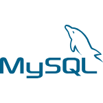

# Upcoming Events Project 📜

Upcoming Events is a web application designed for the efficient management of gastronomic events in the region of Asturias, Spain. This platform provides organizers and participants with an intuitive and comprehensive interface to plan, promote, and participate in events related to the rich Asturian culinary tradition.

## WEB FUNCTIONALITIES ✔️

When starting the application we would arrive at the home page, where we can visualize the header with its different options (log in, registration and the events section), a slider with the different events highlighted by the administrator and future events that have not yet been completed.

On the login page we would have the corresponding login and registration form, so that the user (or the administrator) can access their respective dashboards. 

In the user dashboard, we have the past events and the current events to which the user is registered, as well as the option to unsubscribe or return to the home page to sign up for a new event.

In the administrator dashboard, we have at our disposal all the events with the option to edit, highlight or delete them. You can even create a new event if you wish.

In all the cards are the corresponding data of each event, date, place, publicity photo...etc.

## Recommended IDE Setup

[VSCode](https://code.visualstudio.com/) + [Volar](https://marketplace.visualstudio.com/items?itemName=Vue.volar) (and disable Vetur) + [TypeScript Vue Plugin (Volar)](https://marketplace.visualstudio.com/items?itemName=Vue.vscode-typescript-vue-plugin).

## Type Support for `.vue` Imports in TS

TypeScript cannot handle type information for `.vue` imports by default, so we replace the `tsc` CLI with `vue-tsc` for type checking. In editors, we need [TypeScript Vue Plugin (Volar)](https://marketplace.visualstudio.com/items?itemName=Vue.vscode-typescript-vue-plugin) to make the TypeScript language service aware of `.vue` types.

If the standalone TypeScript plugin doesn't feel fast enough to you, Volar has also implemented a [Take Over Mode](https://github.com/johnsoncodehk/volar/discussions/471#discussioncomment-1361669) that is more performant. You can enable it by the following steps:

1. Disable the built-in TypeScript Extension
    1) Run `Extensions: Show Built-in Extensions` from VSCode's command palette
    2) Find `TypeScript and JavaScript Language Features`, right click and select `Disable (Workspace)`
2. Reload the VSCode window by running `Developer: Reload Window` from the command palette.

## Customize configuration

See [Vite Configuration Reference](https://vitejs.dev/config/).

## Project Setup

```sh
npm install
```

### Compile and Hot-Reload for Development

```sh
npm run dev
```

### Type-Check, Compile and Minify for Production

```sh
npm run build
```

### Run Unit Tests with [Vitest](https://vitest.dev/)

```sh
npm run test:unit
```

### Lint with [ESLint](https://eslint.org/)

```sh
npm run lint
```

## TOOLS ⚙️
 
 
 
 
 
 
 
 
 

 ## TEAM 🌐

 - [Vero Sampedro](https://github.com/verosampedro)

 - [Mark Kil](https://github.com/MarkWebDeveloper)

 - [Erika Gamarra](https://github.com/erigt)

 - [Luis Pardo](https://github.com/luispardosuarez)

 - [Alicia González](https://github.com/Aliglez)
 
